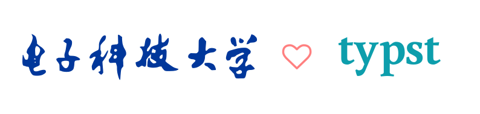

<h1 align="center">
  
</h1>

  

  

  

  

# 📚 电子科技大学学位论文模板
> [!CAUTION]
> 模板所需 [Typst](https://typst.app/home/) 版本 >= `0.13.0` (可以通过`typst --version`检查)
> 
> 安装Typst: [官网安装方式](https://github.com/typst/typst?tab=readme-ov-file#installation)

# 🙋 为什么使用 Typst?
> [!IMPORTANT]  
> 学校文件里并没有说明必须使用 Word/LaTex, 只要格式正确既可. 且在所有流程中提交的**只是PDF**格式文件
> 
> 此外还可以参考[一只方橙](https://github.com/OrangeX4)在知乎的[一篇回答](https://www.zhihu.com/question/591143170/answer/3304601296)，该回答详细说明了Typst的优势

# 🚀 快速开始
  移步[电子科技大学学位论文 Typst 快速开始](https://github.com/qujihan/uestc-typst-thesis-example)
  
  该仓库使用了本模板编写了使用文档, 包含算法/三线表/图文引用等学位论文会使用的多种格式

# 🔗 参考
- [研究生学位论文](https://gr.uestc.edu.cn/xiazai/114/3917)
- [本科学位论文](https://www.jwc.uestc.edu.cn/upload/电子科技大学本科毕业设计（论文）管理办法（2018修订版）.pdf)
- [视觉形象识别系统](https://vi.uestc.edu.cn/)

# 💖 贡献者们
